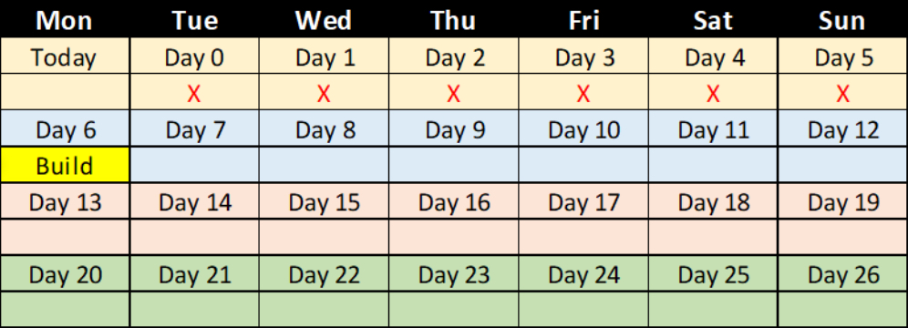
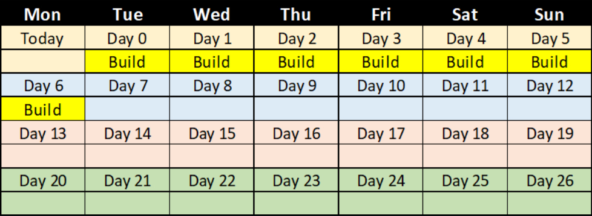

* OpCon (SAM) will search the database for Schedules and Jobs that must run on a specific date
  * Based on information stored in Master tables, SAM will add Schedules and Jobs to Daily tables
* Schedules can be built manually or automatically


### Auto Build

* Auto building **X days in advance** is the starting day to build on
* Auto building **for Y days** is how far out to build
* OpCon builds Schedules automatically at midnight (by default)
* Best Practice for Autobuild is **7 days in advance for 1 day**
 
  * Example: ```7``` days in advance for 1 day will build on the 7th counted day in the future (the first counted day is Day ```0```)

   

  * Example: ```0``` days in advance for ```7``` days will build **daily** for ```7``` days (the first counted day is Day ```0```)
 
   


### Manual Build

* The **Build** button on the Operations Summary Page activates the Schedule Build Wizard
* The Selection page allows the user to choose a Master Schedule to build with multiple options:
  * Date Range Selection
  * On Hold or Release Status
  * Overwrite Existing Schedules Option
* Users can also filter Schedules with Auto-build or Multi-Instance configurations


### Schedule Build Grouping

* Multiple Builds can be bundled and tracked as a group
* The bundle can be expanded to view and monitor the status of each Build


## Enterprise Manager

<details>

#### Autobuild

##### Auto-build Example 1:


##### Auto-build Example 2:


#### Manual Build

* The **Build Schedules** screen contains a list of Schedules to build, all information needed to build a Schedule, and a Build Results list


</details>